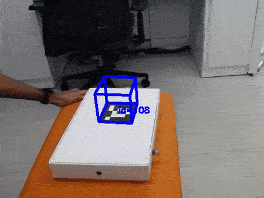
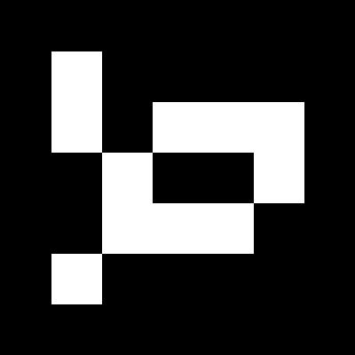
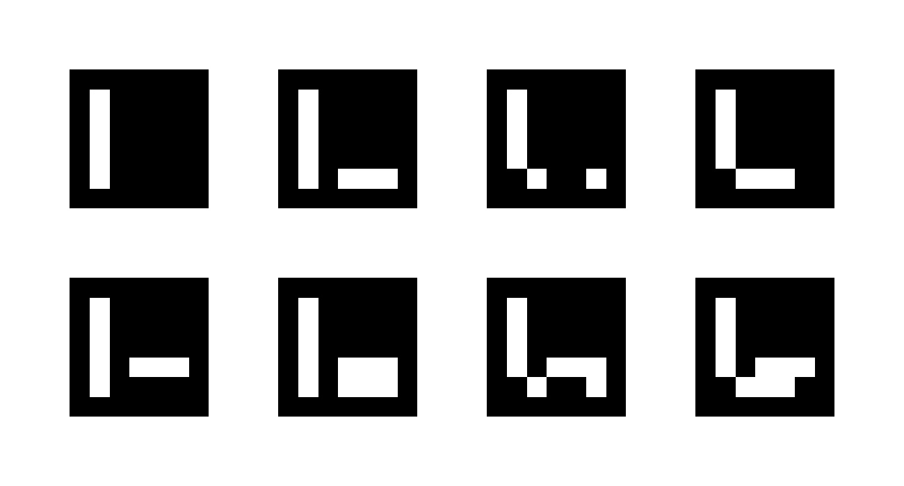
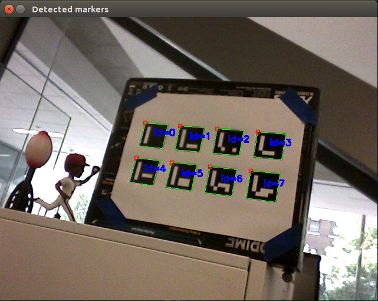
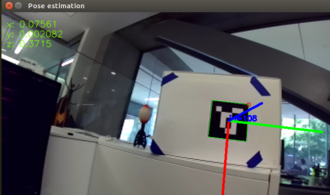

# ArUco Markers

:bangbang: **IMPORTANT**: 
This assumes you are using OpenCV4.
If you need to use OpenCV3, please checkout the `cv3` branch before installing dependencies.
As there are some breaking changes in OpenCV libraries, some parts of the OpenCV4 codes are not compatible with OpenCV3.


<center>
  
</center>

This repository includes codes that can be used to work with the augmented reality library, [ArUco](https://www.uco.es/investiga/grupos/ava/node/26).
A few programs in the repository, including the codes to create the markers and to calibrate the cameras, are copies of the examples included with the OpenCV libraries with minor changes, which are added so that everything is in one place.

## Contents
1. [Installing OpenCV](#installing-opencv)
    1. [Installing v4.5.3 (recommended)](#installing-v453-recommended)
    2. [Installing the Latest](#installing-the-latest)
2. [Generating Markers](#generating-markers)
3. [Detecting the Markers](#detecting-the-markers)
4. [Camera Calibration](#camera-calibration)
5. [Pose Estimation](#pose-estimation)
6. [Draw a Cube](#draw-a-cube)


## Installing OpenCV

You can install the standalone ArUco library by downloading the source files which can be found in the above website and building and installing them.
But it is highly recommended to install ArUco library packed in OpenCV library.
The instruction below are for installing OpenCV with ArUco library.

You can install OpenCV using the master branch of their repository, **OR** using the submodules added to this repository.
Building and installing OpenCV with the provided submodules guarantees that the other codes on this repository work without issues.
So it is recommended to install from the submodules.


### Installing v4.5.3 (recommended)
```
sudo apt-get install build-essential
sudo apt-get install cmake git libgtk2.0-dev pkg-config libavcodec-dev libavformat-dev libswscale-dev
sudo apt-get install python-dev python-numpy libtbb2 libtbb-dev libjpeg-dev libpng-dev libtiff-dev libdc1394-22-dev

git submodule update --init
cd libraries/opencv
mkdir build && cd build
cmake -DCMAKE_BUILD_TYPE=Release -DCMAKE_INSTALL_PREFIX=/usr/local -DOPENCV_EXTRA_MODULES_PATH=../../opencv_contrib/modules ..
make -j4  # if you have more/less cores on your computer, substitute 4 with the number of cores
          # use command "nproc" to find the number of cores
sudo make install
```


### Installing the Latest
```
sudo apt-get install build-essential
sudo apt-get install cmake git libgtk2.0-dev pkg-config libavcodec-dev libavformat-dev libswscale-dev
sudo apt-get install python-dev python-numpy libtbb2 libtbb-dev libjpeg-dev libpng-dev libtiff-dev libjasper-dev libdc1394-22-dev

git clone https://github.com/opencv/opencv.git
git clone https://github.com/opencv/opencv_contrib.git

# If you need a specific version, you should checkout that version on 
# both the repositories before executing the below commands.

mkdir build && cd build
cmake -DCMAKE_BUILD_TYPE=Release -DCMAKE_INSTALL_PREFIX=/usr/local -DOPENCV_EXTRA_MODULES_PATH=../../opencv_contrib/modules ..
make -j4  # if you have more/less cores on your computer, substitute 4 with the number of cores
          # use command "nproc" to find the number of cores
sudo make install
```


## Generating Markers
To detect the markers using a camera, first you need to print the markers.
The ArUco library comes with few functions to generate the markers, and they are copied to this repository for the ease of finding them.

```
cd create_markers
mkdir build && cd build
cmake ../
make

# Create a single marker.
# For details about the parameters, run just ./generate_marker
./generate_marker --b=1 -d=16 --id=108 --ms=400 --si marker.jpg

# Create a marker board.
# For details about the parameters, run just ./generate_board
./generate_board --bb=1 -h=2 -w=4 -l=200 -s=100 -d=16 --si board.jpg
```

The generated marker should look like this:
<center>
   
</center>

The generated board should look like this:
<center>
  
</center>


## Detecting the Markers
First, print the [generated markers](#generating-markers).
Connect a camera to the computer and run below commands:
```
cd detect_markers
mkdir build && cd build
cmake ../
make

./detect_markers
```

All the detected markers would be drawn on the image.
<center>
  
</center>


## Camera Calibration
To accurately detect markers or to get accurate pose data, a camera calibration needs to be performed.

Run below commands to perform the camera calibration:
```
cd camera_calibration
mkdir build && cd build
cmake ../
make

# Below command is accurate only if you used the same parameters when you generated the markers.
# If you changed any of them, change below arguments accordingly.
./camera_calibration -d=16 -dp=../detector_params.yml -h=2 -w=4 -l=<side length of a single marker (in meters)> -s=<separation between two consecutive markers in the grid (in meters)> ../../calibration_params.yml

# If you want to calibrate with an already saved video, use `-v` flag.
./camera_calibration -v=/path/to/your/video.avi -d=16 -dp=../detector_params.yml -h=2 -w=4 -l=<side length of a single marker (in meters)> -s=<separation between two consecutive markers in the grid (in meters)> ../../calibration_params.yml
```

Then points the camera at the marker at different orientations and at different angles, and save those images by pressing key `C`. 
These instructions should appear on the screen.
Around 30 images should be good enough.


## Pose Estimation
To estimate the translation and the rotation of the ArUco marker, run below code:
```
cd pose_estimation

mkdir build && cd build
cmake ../
make

./pose_estimation -l=<side length of a single marker (in meters)>

# or, if you are trying this on an already saved video
./pose_estimation -l=<side length of a single marker (in meters)> -v=<path to the video>
```

Below image shows the output of this code. 
The distances shown in the left top corner are in meters with axes as same as those defined in OpenCV model, i.e., `x`-axis increases from left to right of the image, `y`-axis increases from top to bottom of the image, and the `z`-axis points outwards the camera, with the origin on the top left corner of the image.
The axes drawn on the markers represent the orientation of the marker with the Red-Green-Blue axes order.
<center>
  
</center>


## Draw a Cube 
To estimate pose and draw a cube over the ArUco marker, run below code:
```
cd draw_cube

mkdir build && cd build
cmake ../
make

./draw_cube -l=<side length of a single marker (in meters)>

# or, if you are trying this on an already saved video
./draw_cube -l=<side length of a single marker (in meters)> -v=<path to the video>
```

Below GIF shows the output of this code.

<center>
  
</center>
